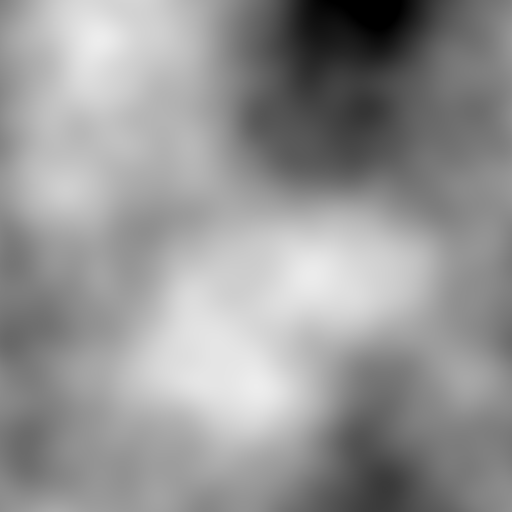
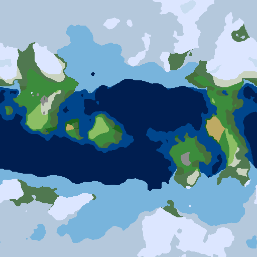
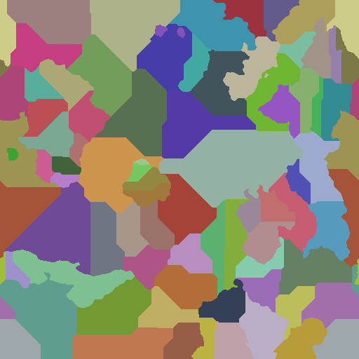
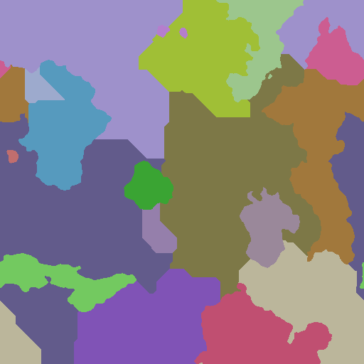

# 🗺️ MapGen Web Demo

[](https://san-smith.github.io/mapgen-web-demo/)
[](LICENSE)
[](https://www.rust-lang.org)

## Interactive procedural world generator powered by Rust + WebAssembly

👉 **[Try the Live Demo](https://san-smith.github.io/mapgen-web-demo/)** 👈 </br>
**[Original Library (mapgen)](https://github.com/san-smith/mapgen)**

---

## Features

- **Multiple World Types**: Earth-like, Supercontinent, Archipelago, Mediterranean, Ice Age, Desert
- **Full Parameter Control**: Seed, temperature, humidity, elevation, island density, province count
- **Multiple Map Layers**:
  - Heightmap (terrain elevation)
  - Biomes (16 distinct biomes with realistic transitions)
  - Provinces (administrative divisions with types and coastal status)
  - Regions (grouped provinces forming continents and sea basins)
- **Interactive Controls**:
  - Zoom with mouse wheel
  - Pan by dragging
  - Reset zoom button
  - Click any province/region for detailed information
- **Blazing Fast**: WASM-powered generation runs entirely in your browser
- **Responsive Design**: Works on desktop and tablet screens

---

## Screenshots

| Heightmap Layer                | Biomes Layer                |
| ------------------------------ | --------------------------- |
|  |  |

| Provinces Layer                   | Regions Layer                 |
| --------------------------------- | ----------------------------- |
|  |  |

---

## Try It Now

No installation required! Just visit:
👉 **[https://san-smith.github.io/mapgen-web-demo/](https://san-smith.github.io/mapgen-web-demo/)**

### Quick Start Guide

1. Adjust parameters (seed, world type, size, climate)
2. Click **"Generate World"**
3. Switch between map layers using radio buttons
4. Zoom with mouse wheel, reset with "Reset Zoom" button
5. Click any province/region to see detailed information

---

## Local Development

### Prerequisites

- Rust 1.70+ (`rustup update stable`)
- Python 3 (for built-in HTTP server)

### Setup & Run

```bash
# Clone the repository
git clone https://github.com/san-smith/mapgen-web-demo.git
cd mapgen-web-demo

# Build WASM and start local server
./run_dev.sh
```

Then open **<http://localhost:8080>** in your browser.

### Project Structure

```sh
mapgen-web-demo/
├── src/               # Rust WASM code
│   └── lib.rs         # WASM interface and generation logic
├── www/               # Frontend assets
│   ├── index.html     # Main page
│   └── style.css      # Styles
├── run_dev.sh         # Development script
├── Cargo.toml         # Rust dependencies
└── README.md
```

---

## Built With

| Technology                                                                | Purpose                                   |
| ------------------------------------------------------------------------- | ----------------------------------------- |
| **[mapgen](https://github.com/san-smith/mapgen)**                         | Core procedural generation library (Rust) |
| **[wasm-pack](https://rustwasm.github.io/wasm-pack/)**                    | WASM compilation and packaging            |
| **[wasm-bindgen](https://github.com/rustwasm/wasm-bindgen)**              | Rust ↔ JavaScript bindings                |
| **[web-sys](https://rustwasm.github.io/wasm-bindgen/web-sys/index.html)** | Browser API access                        |
| **Canvas API**                                                            | Map rendering and interaction             |
| **GitHub Pages**                                                          | Hosting and deployment                    |

---

## Technical Highlights

### WASM Integration

- Zero-copy data transfer using `Float32Array` and `Uint32Array`
- Deterministic generation matching native Rust behavior
- Optimized build pipeline with `wasm-opt` for smaller bundle size

### Map Rendering

- Efficient pixel-by-pixel rendering using `putImageData`
- Dynamic scaling with aspect ratio preservation
- Smooth zoom transitions with cursor-relative scaling

### User Experience

- Form state reset on page load (no stale values)
- Comprehensive input validation with user-friendly errors
- Animated information panel with province details
- Responsive two-column layout (map + controls)

---

## License

Licensed under either of:

- **MIT License** ([LICENSE-MIT](LICENSE-MIT))
- **Apache License, Version 2.0** ([LICENSE-APACHE](LICENSE-APACHE))

at your option.

---

## Acknowledgements

- **[mapgen](https://github.com/san-smith/mapgen)** team for the incredible procedural generation library
- **[Rust WASM Working Group](https://rustwasm.github.io/)** for excellent tooling and documentation
- **[FastNoise Lite](https://github.com/Auburn/FastNoiseLite)** for high-performance noise generation
- **[PetGraph](https://github.com/petgraph/petgraph)** for graph algorithms
- **Europa Universalis** for inspiration in procedural world design

**Made with ❤️ by [san-smith](https://github.com/san-smith)** </br>
**Powered by Rust + WebAssembly**
